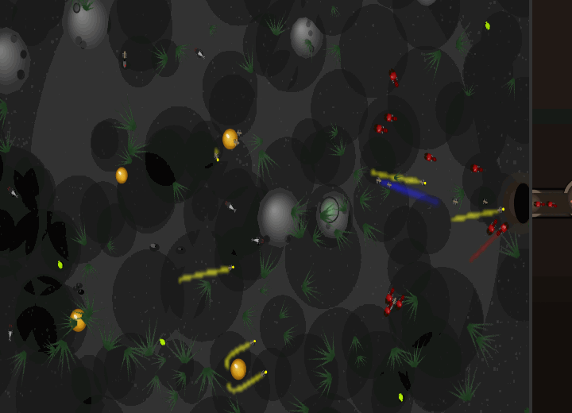

# AntSim V2

[](https://nilsgollub.github.io/AntSim_V2/?colonies=2)
[](LICENSE)
[](https://www.typescriptlang.org/)
[](https://pixijs.com/)

> **▶ [Try it live in your browser](https://nilsgollub.github.io/AntSim_V2/?colonies=2)** — no install needed.

<!-- TODO: add a short demo GIF here for the biggest stars-per-visitor boost, e.g.:
     
     Record ~10 s of two colonies at war, save as docs/preview.gif, drop it in. -->

An agent-based ant-colony simulation in TypeScript: a deterministic, emergent little
world where workers forage along pheromone trails, a queen lays brood, soldiers mob
predators, and — optionally — a **rival colony** wages war next door (border skirmishes,
resource theft and brood raids). It renders on the GPU via **Pixi.js** (with a pure
Canvas-2D fallback) and is light enough to run as a screensaver on a **Raspberry Pi 4**.

Everything random flows through a **seeded PRNG**, so any run is fully reproducible and
the colony's *emergent* behaviour is regression-tested headlessly.

---

## Features

- **Emergent foraging** — workers lay/follow SUGAR, PROTEIN, HOME and DANGER pheromone
  fields (Float32 grids with decay + separable-blur diffusion); trails self-organise into
  roads.
- **Full colony lifecycle** — queen lays eggs → larva → pupa → ant; larval nutrition
  decides the caste (well-fed → soldier). The queen is mortal: an abandoned/starved
  colony actually dies out.
- **Castes & polymorphism** — workers vs. soldiers with size-correlated HP / bite / speed.
- **Predators & coordinated defence** — spiders, predators, beetles, plus harmless prey,
  ladybugs and (milkable) aphids. Against a major threat the colony *rallies*: ants mill
  at a standoff ring, raise the alarm to recruit, then rush in together.
- **Rival colony & war** (optional, on by default) — a second colony on the opposite
  edge. Combat reuses the alarm/mob mechanics; a dominant colony musters raid parties that
  march on the enemy nest and steal **brood** (raised as their own) or **resources**.
- **Two renderers** — GPU **Pixi.js v8** backdrop (baked textures, bloom) with automatic
  fallback to **Canvas-2D**; a separate 2D view of the nest interior.
- **Deterministic & headless-testable** — seeded RNG + a no-DOM harness that asserts on
  emergent outcomes (colony survives, resources keep flowing, population stays in band).
- **Live tooling** — inspect any ant *or* insect, place food, spawn enemies, pan/zoom
  (mouse **and** touch/pinch), screenshot to PNG, live parameter sliders, history graphs,
  and an automated parameter "Analyse" advisor.
- **Pi-friendly** — quality presets + automatic downgrade keep it smooth on low-end
  hardware.

---

## Requirements

- **Node.js ≥ 20.19** (or ≥ 22.12) and npm — required by Vite 7.
- A modern browser. WebGL gives the richer look; without it the app falls back to
  Canvas-2D automatically.

## Getting started

```bash
git clone https://github.com/nilsgollub/AntSim_V2.git
cd AntSim_V2
npm install

npm run dev        # dev server (hot reload) → http://localhost:5173
```

`npm run dev` uses `vite --host`, so the server is also reachable from other devices on
your LAN (handy for testing on a tablet/phone or the Pi). Other scripts:

```bash
npm run build      # type-check (tsc) + production build → dist/
npm run preview    # serve the production build locally
npm run test       # run the test suite once (Vitest)
npm run test:watch # tests in watch mode
```

To serve the production build yourself, `npm run build` then host the `dist/` folder with
any static file server.

---

## Controls & UI

**Camera** — drag to pan, mouse wheel to zoom (zoom-to-cursor). On a touchscreen: one
finger pans, two fingers pinch-zoom, a tap acts as a click.

| Button | Action |
|--------|--------|
| `− 1× +` | Simulation speed (0 / 0.5 / 1 / 2 / 4 / 8×) |
| ⏸ / ▶ | Pause / resume (also **Space**) |
| ⏭ | Single step (while paused) |
| ➕ ➖ ⌖ | Zoom in / out / reset camera |
| 📷 | Screenshot the world view to a PNG download |
| 🔍 | Inspect tool — click an **ant or insect** for live stats |
| 🍬 / 🥩 | Place sugar / protein |
| ☠ | Spawn a predator |
| 🎨 Grafik | Graphics panel (renderer, quality, bloom, pheromone overlay, day/night) |
| Restart | Rebuild the world from a fresh seed |
| Rivalenkolonie | Toggle the second (rival) colony on/off |
| 📈 Stats / 🎛 Params / ⚙ Analyse | History graphs / live parameter sliders / tuner advisor |

### URL parameters

Append to the URL to preconfigure a run without touching the UI:

| Param | Example | Effect |
|-------|---------|--------|
| `seed` | `?seed=12345` | Reproduce an exact run (otherwise seeded from the clock) |
| `colonies` | `?colonies=2` | `1` = solo, `2` = rival colony + war |
| `quality` | `?quality=LOW` | Pin render quality (`ULTRA_LOW`…`ULTRA`), overrides saved/auto |

Example: `index.html?colonies=2&quality=LOW` — the exact URL the kiosk screensaver uses.

UI choices (quality, speed, pheromone overlay, rival toggle, …) persist in
`localStorage`; a URL parameter always wins over the saved value.

---

## Quality & performance

The **🎨 Grafik** panel exposes the renderer (WebGL/Canvas), a quality preset
(`Ultra Low` → `Ultra`), bloom, the pheromone overlay and day/night tint.

On a Raspberry Pi 4, pick **Low** (the kiosk pins `?quality=LOW`, ~30 fps). At low presets
pheromone diffusion is off (decay-only), the canvas renders at 0.4× resolution, the ant
cap drops, and particles/shadows/animation are trimmed. The camera, inspector and tuner
stay fully functional at every quality level.

An **auto-downgrade** triggers after 60 consecutive frames below 20 FPS (10 s cooldown
between steps), so the sim self-tunes on first launch. Crucially, *simulation fidelity is
decoupled from quality* — pheromone grid resolution / diffusion / update cadence live in
`CONFIG`, not the preset — so the colony behaves identically at every graphics level (a
test proves it).

---

## Determinism & headless testing

All simulation randomness flows through a seeded PRNG (`src/rng.ts`, mulberry32) instead
of `Math.random()`, so a run is fully reproducible from its seed. Rendering-only
randomness (background texture, grass) stays on `Math.random()` and never affects sim
state.

`runHeadless(seed, ticks)` (`src/simulation/headless.ts`) runs the whole simulation with
no DOM and returns aggregate metrics. The tests use it to assert on **emergent** outcomes:

- **Golden snapshots** — exact metrics at fixed seed/tick pin behaviour; any unintended
  change shifts them and fails the test. They're re-pinned *deliberately* when a change is
  meant to alter behaviour.
- **Soak + multi-seed invariants** — the colony establishes and survives, stays under the
  population cap, and never deadlocks a resource at zero.
- **Quality-independence** — identical metrics across all quality presets.

```bash
npm run test
```

Tests run in a `node` environment (no DOM); `config.ts` guards every `window.*` read so it
imports safely from tests. Test files live beside their modules as `*.test.ts`.

---

## Project structure

```
src/
├── main.ts                 Entry point: render loop, input (mouse + touch), HUD, panels,
│                           screenshot, URL params, screensaver auto-restart
├── config.ts               All tunable simulation constants (grouped sub-objects)
├── configStore.ts          Runtime CONFIG overrides (live sliders / tuner)
├── rng.ts                  Seeded PRNG (mulberry32) — the determinism backbone
├── PerformanceManager.ts   Quality presets + FPS auto-downgrade
├── graphics/
│   ├── Camera.ts           Pan/zoom with screen↔world mapping (mouse + touch)
│   ├── Renderer.ts         Canvas-2D rendering (world fallback + nest interior view)
│   └── PixiBackdrop.ts     WebGL (Pixi.js v8) world renderer: baked textures, bloom
└── simulation/
    ├── World.ts            Central controller; owns colonies[] + shared environment
    ├── Colony.ts           One colony's state (queen, nest, brood, stockpiles, raids)
    ├── Ant.ts              Agent data + low-level movement/sensing/steering
    ├── antStates.ts        The FSM state handlers (forage/return/nurse/combat/raid/…)
    ├── Queen.ts            Egg laying + mortality
    ├── Brood.ts            Egg → larva → pupa → ant; nutrition-driven caste
    ├── Insect.ts           Prey & predators (spider, beetle, ladybug, aphid, …)
    ├── Food.ts             Sugar / protein / corpse sources
    ├── PheromoneGrid.ts    Float32 fields with decay + separable-blur diffusion
    ├── Terrain.ts          Obstacles + circle–circle collision
    ├── SpatialGrid.ts      Ant proximity queries
    ├── Nest.ts             Node-graph underground structure + greedy routing
    ├── headless.ts         runHeadless(seed, ticks) → metrics (no DOM)
    └── SimObserver.ts      Metric sampling + the parameter-tuner advisor
```

See [ROADMAP.md](ROADMAP.md) for the running status/changelog and
[ARCHITECTURE_AND_MECHANICS.md](ARCHITECTURE_AND_MECHANICS.md) for deeper design notes.

---

## Configuration & tuning

Every tunable constant lives in [src/config.ts](src/config.ts), grouped under e.g.
`CONFIG.ant.*` (detection ranges, energy thresholds), `CONFIG.pheromone.*` (decay,
diffusion, deposits), `CONFIG.brood.*` (lifecycle, caste threshold), `CONFIG.combat.*`
(alarm, mob/rally, raids) and `CONFIG.enemy.*` (predator HP/damage).

For live experimentation, use **🎛 Params** (sliders, applied at runtime via
`configStore`) or **⚙ Analyse**: after the sim has run a while, `SimObserver` samples
metrics and prints severity-tagged observations with concrete `CONFIG.*` suggestions and
an explanation of each change's effect.

> Note on balance: long-run colony survival is **RNG-stream dominated**, not
> balance-tuning dominated — tweaking enemy strength mostly reshuffles *which* seeds
> collapse. Use the soak to guarantee establishment, not immortality.

---

## Deployment

The build is a static bundle (`dist/`), hostable anywhere. Two documented targets:

- **Home Assistant** (static `www`): `npm run build`, then mirror `dist/` into
  `config/www/antsim/` → reachable at `/local/antsim/`. Requires `vite.config base: './'`
  (relative paths, already set) for subpath hosting. Details:
  [DEPLOYMENT_HAOS.md](DEPLOYMENT_HAOS.md).
- **Raspberry Pi kiosk / screensaver**
  ([nilsgollub/Ameisennest](https://github.com/nilsgollub/Ameisennest), `kiosk/`): a
  Chromium kiosk shows the sim as a screensaver in an iframe. Its nginx reverse-proxies
  `/antsim/` to the Home-Assistant build, strips `X-Frame-Options` (so it can be embedded)
  and forces `Cache-Control: no-store` (so new builds appear immediately). AntSim is
  deployed **once** (on HA); the kiosk just displays it.

---

## License

[MIT](LICENSE) © nilsgollub. Free to use, fork and build on — attribution appreciated.
